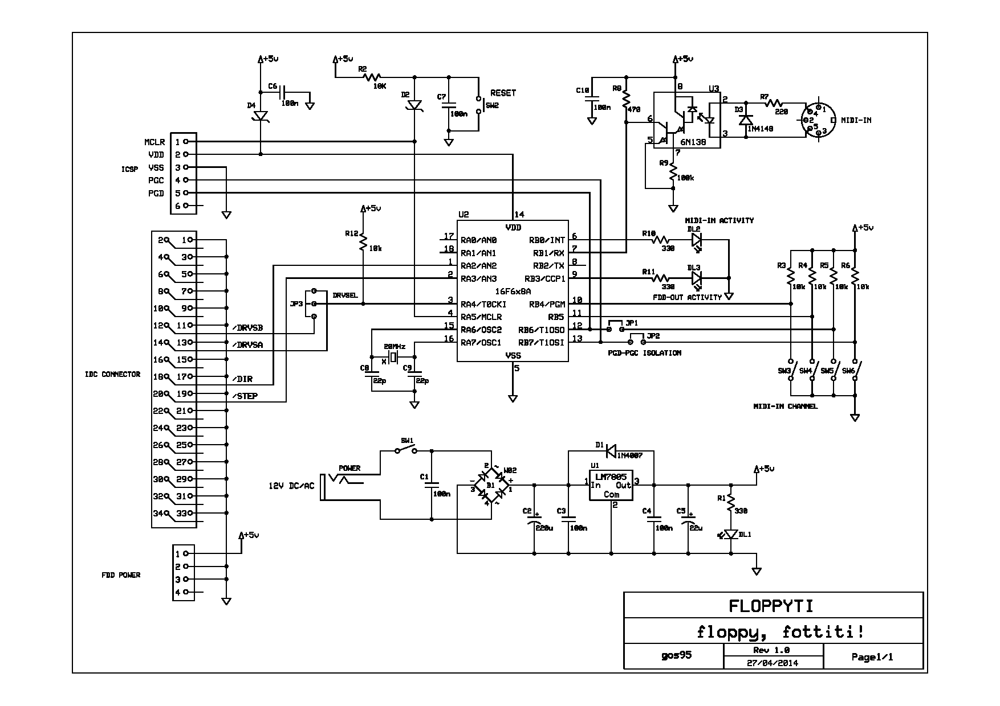

# Floppyti
**Type**: Standalone Project | **Status**: Completed

### Floppy, fottiti!

A floppy-drive music player driven by MIDI-IN interface.

## Overview
Floppyti is a bare-metal hardware solution designed to transform a common 3.5-inch floppy disk drive into a monophonic musical instrument. The system intercepts MIDI-IN messages and translates them into stepper motor movement sequences, generating musical notes through the mechanical vibrations of the drive's head.

## Specifications
- **MCU**: 8-bit Microchip PIC 16F6x8.
- **Input Interface**: Optoisolated MIDI-IN port for real-time note reception.
- **Audio Generation**: Direct frequency control of the drive's mechanical stepper motor.

## Technical Stack
*   **Design**: Schematics and PCB layouts developed with **ExpressPCB** (using custom **[expresspcb-goslib](https://github.com/gom9000/expresspcb-goslib)** assets).
*   **Firmware**: Written in **Microchip Assembler (MPASM)**.
*   **Toolchain**: Microchip MPLAB X IDE.

## Repository Structure
*   `firmware/`: Contains the MPLAB X project and the `.asm` source files.
*   `hardware/`: ExpressPCB schematic (`.sch`) and PCB layout (`.pcb`) files.
*   `media/`: Videos and images of the built device in action.

## Hardware

### Schematic

### PCB Layout

## About & License
**Author**: Alessandro Fraschetti (gom9000). 
**License**: Licensed under the **MIT License**.
