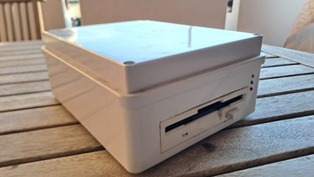
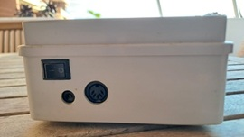
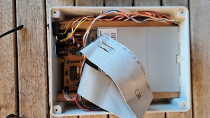
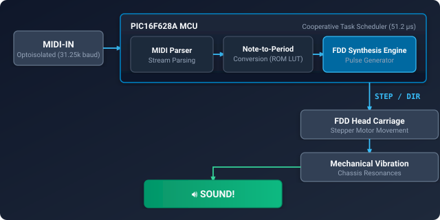
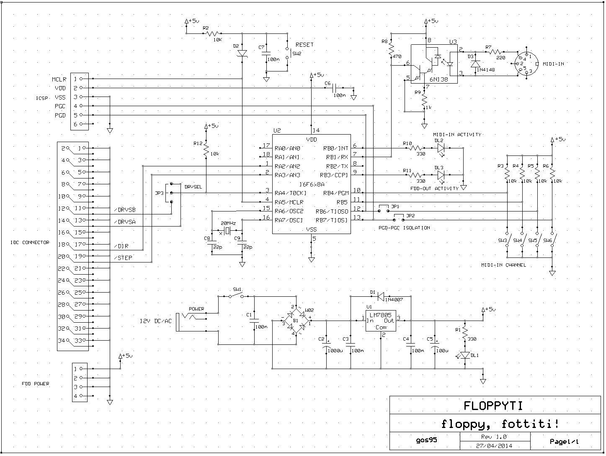
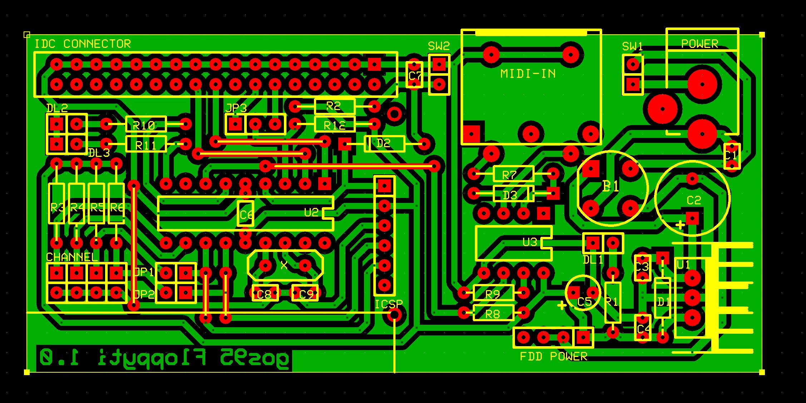

# Floppyti
**Type**: MIDI Audio Module | **Status**: Completed

**Floppy, fottiti!**

A floppy-drive music player driven by a MIDI-IN interface.  
Floppyti is a simple and funny, bare-metal hardware solution designed to transform a common 3.5-inch floppy disk drive into a monophonic musical instrument. The system receives MIDI-IN messages and translates them into stepper motor movement sequences, generating musical notes through the mechanical vibrations of the drive's head.

<video src="https://github.com/user-attachments/assets/031a590b-fdc7-47fe-906f-87045281431c" controls width="100%">
  Your browser does not support the video tag.
</video>

## Specifications
- **MCU**: 8-bit Microchip PIC16F628A.
- **Input Interface**: Optoisolated MIDI-IN port for real-time note reception.
- **Audio Generation**: Audio tones generated by frequency-controlled stepper motor movement.
- **Pitch Range**: Approximately 3 octaves, from octave 2 to octave 5.
- **Monophonic**: last-note-triggered playback.

## Technical Stack
*   **Design**: Schematics and PCB layouts developed with **ExpressPCB** (using custom **[expresspcb-goslib](https://github.com/gom9000/expresspcb-goslib)** assets).
*   **Firmware**: Written in **Microchip Assembler (MPASM)**.
*   **Toolchain**: Microchip MPLAB X IDE + PICkit2.

## Architecture & Hardware

### High-Level Architecture

### Schematic

### PCB Layout

## Technical Notes & Timbre Mechanics

### Firmware MPASM
The firmware uses a cooperative, timer-driven task scheduler rather than interrupt-driven timing. Each Timer0 overflow ($51.2\,\mu\text{s}$) advances the MIDI acquisition, message parsing, activity indication and FDD synthesis tasks in a deterministic sequence.

### FDD Boot Sequence (POST)
The system does not read or connect the physical `TRACK0` signal from the FDD interface. On startup, the firmware forces 90 steps outward (`step_out`) to guarantee that the drive head reaches its mechanical end-stop (Track 0 at the outer edge of the disk) regardless of its starting position. It then moves the head 40 steps inward (`step_in`) to land approximately at the midpoint of the 80-track physical range.

### Acoustic Dynamics & Tremolo
The physical timbre generated by the drive depends directly on the head carriage's movement bounds before direction reversal:

* **Continuous Step Reversal (`fddrange = 1`)**: Reversing direction at every single step keeps the head oscillating locally in a steady, uniform cycle, yielding a smoother and continuous tone.

* **Extended Sweep (`fddrange > 1`)**: Allowing multiple sequential steps in a single direction before reversing creates a cleaner square-wave line during the sweep, periodically broken by the higher-energy mechanical impact of the direction reversal at each boundary. This periodic interruption introduces a strong mechanical amplitude modulation (**tremolo**) to the emitted note.

*(Note: A toggle switch or MIDI control could be used to dynamically adjust the step sweep threshold at runtime, effectively introducing an envelope/timbral control over the emitted sound. In the current build, the firmware hardcodes the threshold to 1.)*

## Repository Structure
*   `firmware/`: Contains the MPLAB X project and the `.asm` source files.
*   `hardware/`: ExpressPCB schematic (`.sch`) and PCB layout (`.pcb`) files.
*   `resources/`: Videos and images of the built device in action.

## About & License
**Author**: Alessandro Fraschetti (gom9000).  
**Technical Notes**: The hardware design was supported by **ExpressPCB** and the custom **[expresspcb-goslib](https://github.com/gom9000/expresspcb-goslib)** libraries.  
**License**: This experience is licensed under the [MIT License](LICENSE).
